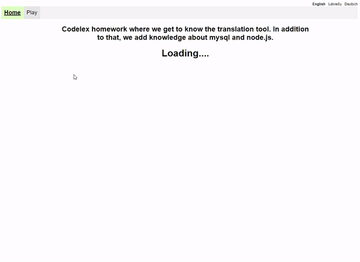

# 18-MD-Simple-RPS-game

Codelex homework where we get to know the translation tool `i18n` .
In addition to that, we add knowledge about `MySQL` and express.js.

Homework is about making game rock-paper-scissors in `React`.
Homework consists from tree parts.

## Preview

1. Front end `React Vite App`
2. Back end `MySQL` database on `Docker`
3. Back end server on `Express Typescript`

## The first part of the homework is this repository.
After You downloaded this repository, You need to open it in Your code editor and run `npm install`.

You can run comand `npm run dev`.
This comand will run React app on (http://localhost:5173/).
For the application to run properly, You need to do the next steps.

## The second and Third part.
`Express Typescript` server and `docker files` is on this repository(https://github.com/ArvidsRozitis/18-BE-P2-Simple-RPS-game).
Follow the instructions on the second repository.

